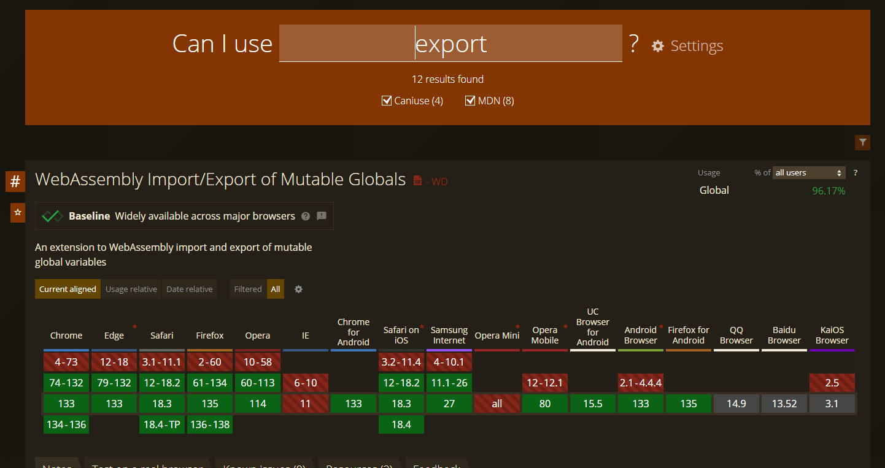
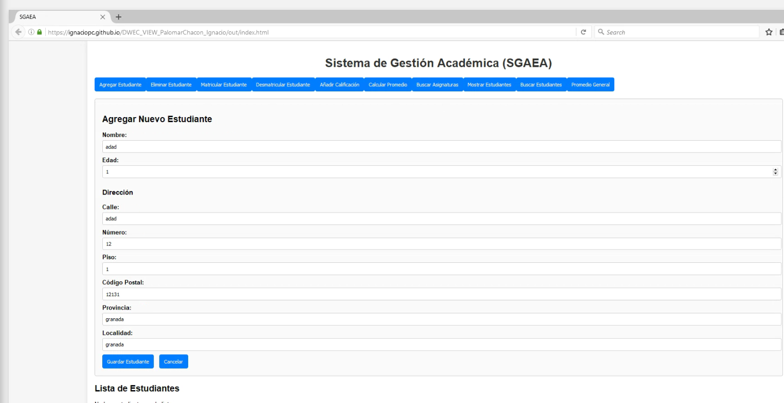

# Proyecto Web con Webpack, Babel y Automatización de Tareas  

Este proyecto tiene como objetivo crear una aplicación web utilizando JavaScript moderno con Webpack para la construcción, Babel para la transpilación, y la automatización de tareas mediante scripts en `package.json`. Al final del proceso, desplegamos el proyecto en una plataforma de pruebas.  

---

## 1. Inicialización del Proyecto  

### 1.1 Crear un nuevo proyecto  
Abre la terminal y navega a la carpeta donde quieras crear el proyecto. Ejecuta el siguiente comando para inicializar un nuevo proyecto Node.js:  

npm init -y
Este comando creará un archivo package.json con la configuración predeterminada.

### 1.2 Instalar dependencias
Luego, instala las dependencias necesarias para Webpack, Babel y los loaders necesarios:


Copiar
Editar
npm install webpack webpack-cli babel-loader @babel/core @babel/preset-env html-webpack-plugin clean-webpack-plugin mini-css-extract-plugin css-loader style-loader --save-dev
Estas dependencias incluyen:

webpack y webpack-cli: Webpack para la construcción de los archivos.
babel-loader, @babel/core, @babel/preset-env: Babel para transpilar el código JavaScript moderno a una versión compatible con navegadores más antiguos.
html-webpack-plugin: Generar el archivo index.html automáticamente.
clean-webpack-plugin: Limpiar la carpeta de salida antes de cada compilación.
mini-css-extract-plugin, css-loader, style-loader: Procesar y extraer archivos CSS.
## 2. Configuración de Webpack
En la raíz del proyecto, crea el archivo `webpack.config.js` con la siguiente configuración:

```js
const path = require('path');
const HtmlWebpackPlugin = require('html-webpack-plugin');
const { CleanWebpackPlugin } = require('clean-webpack-plugin');
const MiniCssExtractPlugin = require('mini-css-extract-plugin'); // Importar el plugin

module.exports = {
  mode: 'production', // Modo de producción
  entry: path.resolve(__dirname, './fuente/src/script.js'),
  output: {
    filename: 'bundle.js',
    path: path.resolve(__dirname, 'out'),
  },
  module: {
    rules: [
      {
        test: /\.js$/,
        exclude: /node_modules/,
        use: {
          loader: 'babel-loader',
        },
      },
      // Nueva regla para procesar los archivos CSS
      {
        test: /\.css$/,
        use: [
          MiniCssExtractPlugin.loader, // Usamos MiniCssExtractPlugin para extraer el CSS
          'css-loader', // Carga los archivos CSS
        ],
      },
    ],
  },
  resolve: {
    extensions: ['.js', '.css'], // Añadimos .css a las extensiones
  },
  target: 'browserslist', // Usamos la configuración de browserslist
  plugins: [
    new CleanWebpackPlugin(),
    new HtmlWebpackPlugin({
      template: path.resolve(__dirname, './fuente/index.html'),
    }),
    new MiniCssExtractPlugin({ // Configuramos el plugin para extraer el CSS
      filename: 'styles.css',
    }),
  ],
};
```
Explicación de la configuración
- entry: El archivo de entrada principal (script.js).
- output: El archivo de salida que Webpack generará (bundle.js), almacenado en la carpeta out.
- module.rules: Define cómo se procesarán los archivos. En este caso, se configura Babel para procesar los archivos .js y el CSS usando los loaders correspondientes.
- plugins: Configura los plugins que automatizan el proceso, como limpiar la carpeta de salida (CleanWebpackPlugin), generar el archivo index.html con el script y los estilos 
- inyectados (HtmlWebpackPlugin), y extraer el CSS a un archivo independiente (MiniCssExtractPlugin).
## 3. Configuración de Babel
Crea el archivo de configuración babel.config.json con el siguiente contenido:
```js

{
  "presets": [
    [
      "@babel/preset-env",
      {
        "useBuiltIns": "usage",
        "corejs": 3
      }
    ]
  ]
}
```
Esto asegura que Babel transpile el código JavaScript moderno (como async/await, import/export) y utilice los polyfills necesarios.

## 4. Crear los Archivos Fuente
En la estructura del proyecto, crea las siguientes carpetas y archivos:
```js

plaintext
Copiar
Editar
fuente
├── css
│   └── estilos.css
└── src
│    ├── asignatura.js
│    ├── direccion.js
│    ├── estudiante.js
│    ├── funciones.js
│   ├── index.js
│   ├── listaAsignaturas.js
│   ├── listaEstudiantes.js
│   ├── nombre.js
│   ├── proyecto1.js
│   └── script.js
└── index.html
node_modules
out
├── bundle.js
├── index.html
└── styles.css
.gitignore
babel.config.json
jsdoc.json
package-lock.json
package.json
README.md
webpack.config.js
```

## 5. Automatización con Scripts
Agrega los siguientes scripts en el archivo package.json para automatizar las tareas:
```
```js
"scripts": {
  "build": "webpack",
  "deploy": "gh-pages -d out"
}
```
- build: Compila el proyecto en modo producción.
- deploy: Despliega el proyecto a GitHub Pages (requiere el paquete gh-pages).
## 6. Despliegue en una Plataforma de Pruebas
En este caso, vamos a desplegar el proyecto utilizando GitHub Pages.

## 6.1 Desplegar con GitHub Pages
Para desplegar el proyecto, utiliza el siguiente comando en la terminal:


- npm run deploy
Esto subirá los archivos generados en la carpeta out a GitHub Pages. 


## 7. Pruebas en Navegadores
He usado BrowserStack para comprobar la funcionalidad. En las siguientes imágenes podemos comprobar cómo he podido registrar un usuario en un navegador que no soporta export ni import.

Como podemos comprobar en la siguiente imagen:
- Donde no se puede usar el export

- Meterme en el firexfox donde no funciona el export

- Meto los datos 

- Confirmo que se guarde
